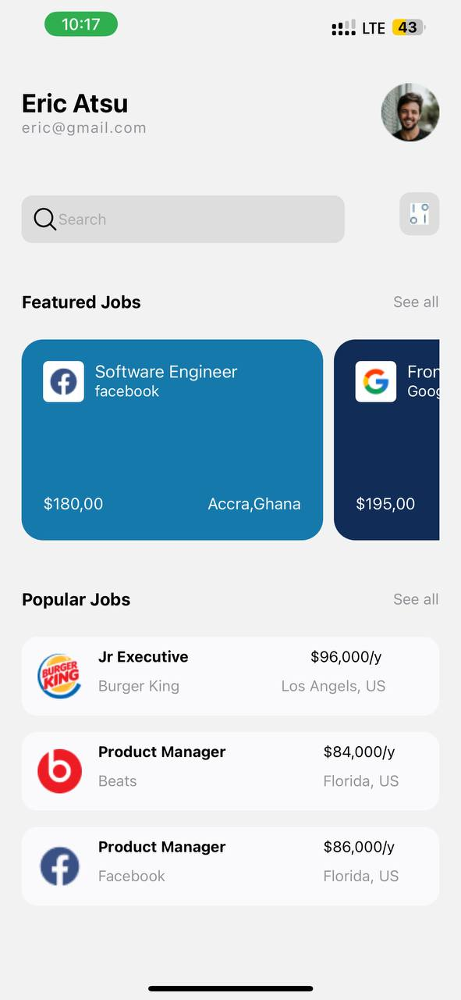

Jobizz Mobile Application

This is a mobile application designed for job seekers. The application consists of two main screens: a login screen and a home screen.

Screens and Components

1. Login Screen

Description:
The Login Screen allows users to enter their credentials or log in using social media accounts (Apple, Google, Facebook).

Components:

 • Name Input: A text input field for the user to enter their name.
 • Email Input: A text input field for the user to enter their email.
 • Log In Button: A button for the user to submit their credentials and log in.
 • Social Media Buttons: Buttons for logging in with Apple, Google, and Facebook accounts.
 • Register Link: A link for users to navigate to the registration screen if they don’t have an account.

Usage:
This screen is used as the entry point of the application. Users need to log in to access the home screen.

2. Home Screen (HomeScreen.js)

Description:
The Home Screen displays user information and available jobs.

Components:

 • User Info: Displays the user’s name and email.
 • Search Bar: A search bar for users to search for specific jobs or positions.
 • Featured Jobs: A section displaying featured job opportunities with job details and location.
 • Popular Jobs: A section displaying a list of popular jobs with job titles, company logos, and salary information.
 

 

 